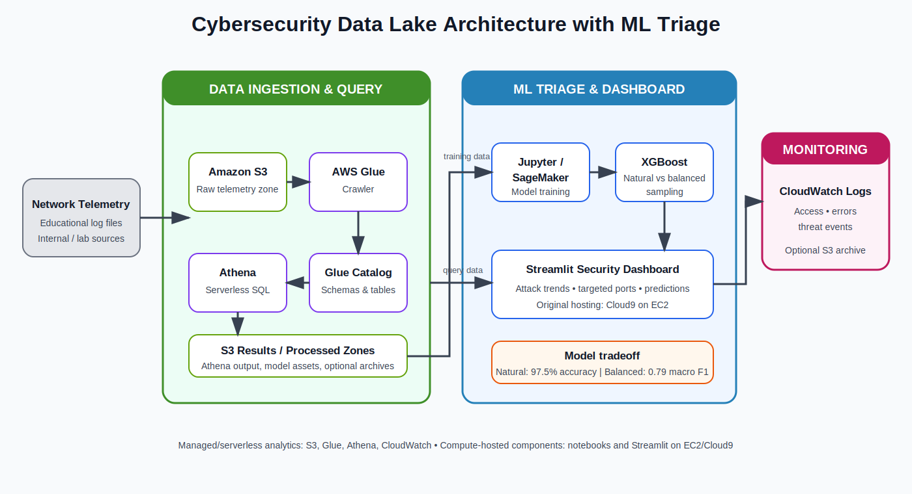

# Automated Serverless Security

[](https://www.python.org/)
[](https://aws.amazon.com/)
[](https://streamlit.io/)
[](LICENSE)

An educational AWS security analytics project that catalogs network telemetry in a data lake, queries it with Athena, visualizes threat patterns in Streamlit, records application events in CloudWatch Logs, and compares two XGBoost sampling strategies.

> **Portfolio note:** This repository documents my implementation and learning from a team-based class project. It focuses on the components I can explain and reproduce: data cataloging, SQL analysis, dashboard development, cloud logging, and model evaluation.

## Architecture




### Data flow

1. Network telemetry is stored in an Amazon S3 raw-data zone.
2. AWS Glue crawls the files and publishes schema metadata to the Glue Data Catalog.
3. Amazon Athena queries the cataloged telemetry and writes query results to S3.
4. Jupyter or SageMaker notebooks prepare the data and train XGBoost models.
5. The Streamlit dashboard reads Athena results and trusted model artifacts to show attack trends, targeted ports, predictions, and model evaluation results.
6. CloudWatch Logs records dashboard access, application errors, and high-volume threat events; S3 can optionally retain longer-term archives.

> **Accuracy clarification:** The original diagram combined two experiments. The natural-distribution model reached about **97.5% accuracy** with **0.61 macro F1**. The balanced model reached about **84.1% accuracy** with **0.79 macro F1**, trading overall accuracy for better minority-attack detection.

**Implementation notes**

- S3, Glue, Athena, and CloudWatch are managed/serverless AWS services.
- The original Streamlit dashboard ran in an AWS Cloud9 EC2 environment, so the complete end-to-end application was not entirely serverless.
- A single S3 bucket with separate prefixes can represent raw data, processed/model files, Athena results, and archived logs; separate buckets are optional.

## What the project demonstrates

- Secure S3 data-lake configuration with public access blocked and default encryption
- Automated schema discovery using AWS Glue
- Athena SQL for malicious-traffic percentage, top attack types, attack timing, and targeted ports
- Streamlit dashboards for threat trends, model comparison, and CloudWatch log review
- XGBoost experiments comparing natural and balanced sampling
- Defensive engineering practices such as environment-based configuration, least-privilege guidance, no committed credentials, and exclusion of untrusted pickle files

## Model evaluation summary

| Model | Accuracy | Macro F1 | Weighted F1 | Main tradeoff |
|---|---:|---:|---:|---|
| Natural distribution | 0.975 | 0.61 | 0.97 | Strong overall accuracy, weak performance on rare classes |
| Balanced sampling | 0.841 | 0.79 | 0.82 | Better rare-class coverage, lower overall accuracy |

The high overall accuracy of the natural model is partly influenced by class imbalance. The balanced model provides a more useful view of performance across minority attack classes. See [docs/model-evaluation.md](docs/model-evaluation.md).

> The detailed matrices and interpretation are documented in [docs/model-evaluation.md](docs/model-evaluation.md).


## Repository structure

```text
.
├── app.py
├── requirements.txt
├── .env.example
├── queries/
│   └── security_queries.sql
├── notebooks/
│   ├── natural_sampling_xgboost.ipynb
│   └── balanced_sampling_xgboost.ipynb
├── docs/
│   ├── setup.md
│   ├── model-evaluation.md
│   └── images/
├── models/
│   └── README.md
└── SECURITY.md
```

## Quick start

### 1. Clone and install

```bash
git clone https://github.com/Taku351/automated-serverless-security.git
cd automated-serverless-security

python3 -m venv .venv
source .venv/bin/activate
pip install -r requirements.txt
```

### 2. Configure the environment

```bash
cp .env.example .env
```

Set your own S3 output location and AWS resource names. Do not commit `.env`.

```bash
export AWS_REGION=us-east-1
export ATHENA_DB=security_data_lake
export ATHENA_TABLE=analytics
export ATHENA_OUTPUT_S3=s3://YOUR-BUCKET/athena-results/
export CLOUDWATCH_LOG_GROUP=ThreatDashboardLogs
```

AWS authentication should come from an IAM role, AWS IAM Identity Center, or a local AWS profile—not hard-coded keys.

### 3. Add model files locally

The ML tab expects:

```text
models/xgboost_natural.pkl
models/xgboost_balanced.pkl
models/label_encoder.pkl
```

These files are intentionally excluded from the repository. See [models/README.md](models/README.md).

### 4. Run the dashboard

```bash
streamlit run app.py
```

For the full AWS setup, see [docs/setup.md](docs/setup.md).

## Security questions answered

The included Athena queries answer:

1. What percentage of traffic is malicious?
2. Which attack types occur most often?
3. When do attacks spike?
4. Which destination ports are targeted most often?

See [queries/security_queries.sql](queries/security_queries.sql).

## Limitations

- The project uses an educational dataset rather than live production traffic.
- Model accuracy alone does not prove production readiness.
- Rare classes still require careful evaluation and more representative data.
- Pickle and joblib files can execute code when loaded; only trusted model artifacts should be used.
- The dashboard is a learning project and should not be treated as an autonomous blocking or containment system.

## Author

**Takuto Yamashiro**  
Information Technology student and AI Development Specialist at Brigham Young University–Hawaii  
[GitHub](https://github.com/Taku351) · [LinkedIn](https://www.linkedin.com/in/takuto-yamashiro-176a64336)
